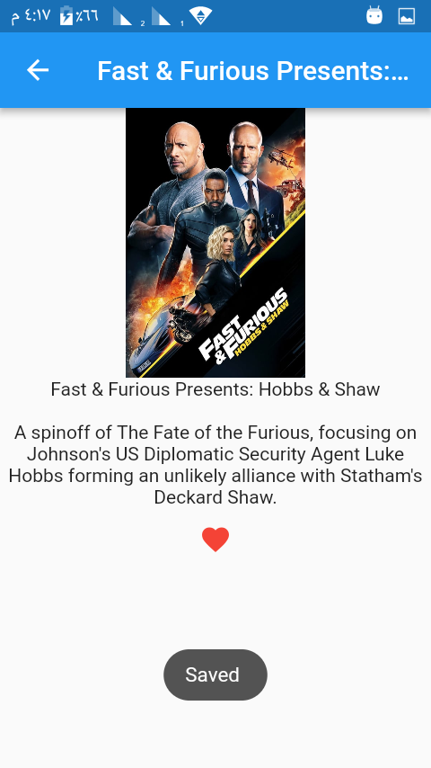
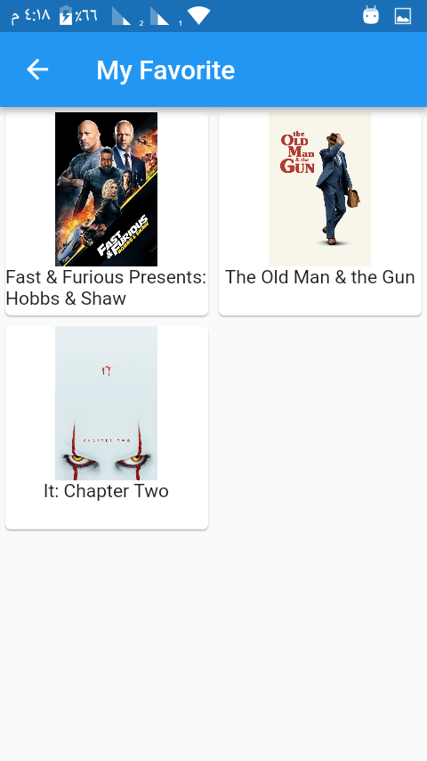
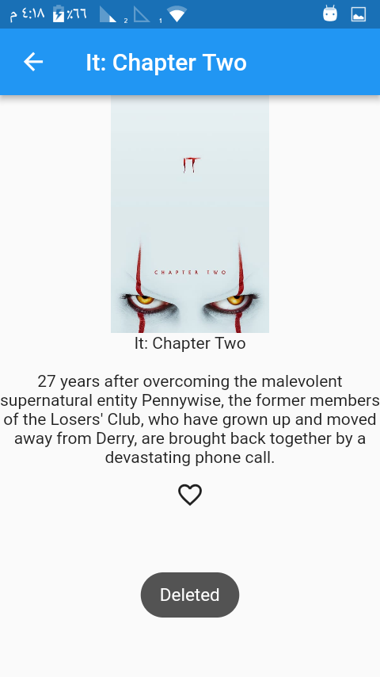
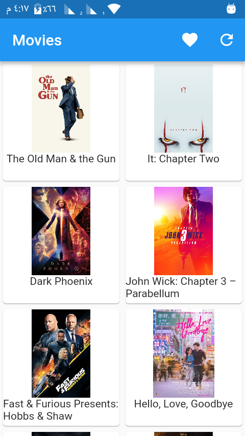

# ITI-Summer-training-2019-GP-Movies-
List Movie from API
It recieve data from online json and display them as gridView 
and it has local dataBase for favorite 
if you aren't connected by internet by default the app didplay your favorite 

## Screens of run

\|
\|
\|
\|

